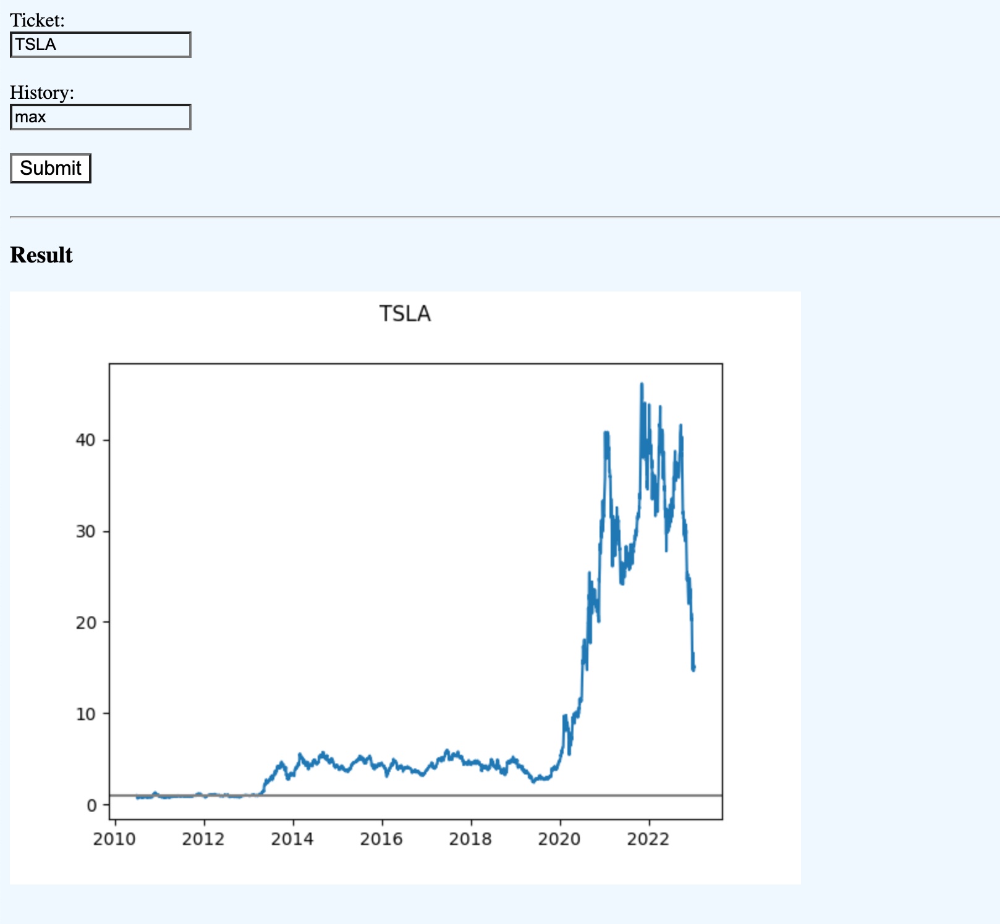
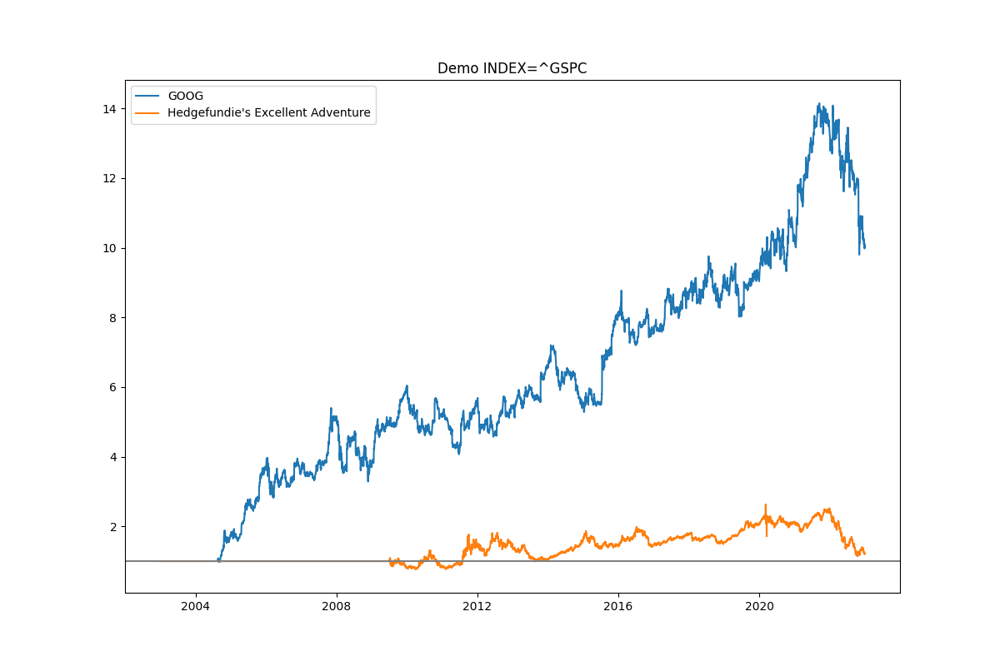

# stock-div-index

### V2: Web app
A [single-page](web/index.html) [flask app](web/app.py) to query result images given 2 parameters `ticket` and `history`(duration).

*Under construction. Only support single stock performance against SPY for now.*

**Demo:**

### V1: Python script

A [python script](main.py) and that visualizes stock or portfolio performances with regard to the benchmark index.

**Demo:**

